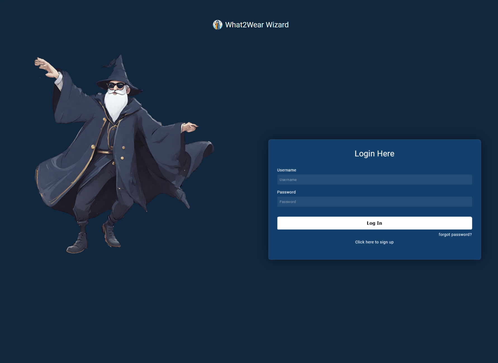

## Introduction

Welcome to What2Wear Wizard! My application aims to provide users with real-time weather updates along with personalized clothing suggestions and activity recommendations based on current weather conditions. Whether you're planning a day outdoors, preparing for a workout, or simply deciding what to wear, my app has you covered.

By leveraging advanced weather APIs, we deliver accurate and up-to-date weather forecasts tailored to your location. My intuitive interface allows users to effortlessly navigate through weather information, receive clothing recommendations suited to the current conditions, and explore a variety of suggested activities suitable for any weather scenario.

Stay informed, stay comfortable, and make the most of every day with What2Wear Wizard!

## Table of contents (optional)

- Requirements
- Installation
- FAQ
- Maintainers
- Screenshots

## Requirements

1. System Requirements
   Web Browser: The application is accessible through modern web browsers such as Google Chrome, Mozilla Firefox, Safari, or Microsoft Edge.
   Internet Connection: An active internet connection is required to fetch real-time weather data from online sources.

2. Supported Platforms
   Desktop: The application is compatible with desktop devices running Windows, macOS, or Linux operating systems.
   Mobile: While currently only available as a web version, future plans include the development of a mobile application for iOS and Android platforms.

3. User Requirements
   Location Access: Users are required to provide their location or specify a location of interest to receive accurate weather forecasts.
   Basic Web Navigation Skills: Users should be familiar with basic web navigation to interact with the application's interface effectively.

4. Development Environment
   Programming Languages: The application is developed primarily using HTML, CSS, JavaScript, and PHP.
   Web Server: A web server environment such as Apache or Nginx is necessary to host the application.
   Database: The application may utilize a database system such as MySQL or PostgreSQL to store user data or weather information (depending on implementation).

5. External APIs
   OpenWeather API: The application relies on a weather API to fetch real-time weather data for the specified location.
   Optional: Geolocation API may be used to automatically detect the user's location if permitted, enhancing user experience.

6.Browser Support
The application is designed to be compatible with modern web browsers, including but not limited to Google Chrome, Mozilla Firefox, Safari, and Microsoft Edge.
While efforts are made to ensure cross-browser compatibility, optimal performance may be experienced on the latest browser versions.

## Installation

To set up the application using Docker, follow these steps:

1. Clone the Repository:
   Clone the application repository from GitHub to your local machine using Git.
   git clone https://github.com/your-username/your-repository.git

2. Install Docker:
   Ensure that Docker is installed on your machine. You can download and install Docker Desktop for your operating system from the official Docker website: https://www.docker.com/get-started

3. Navigate to the Project Directory:
   Open a terminal or command prompt and navigate to the root directory of the cloned repository.
   cd your-repository

4. Build and Run Docker Containers:
   Use Docker Compose to build and run the Docker containers defined in the docker-compose.yml file.
   docker-compose up -d

5. Access the Application:
   Once the Docker containers are running, you can access the application by navigating to http://localhost in your web browser.

6. Explore the Application:
   Explore the features and functionalities of the application. You can make any necessary adjustments or customizations by modifying the source code files located in the cloned repository.

By following these steps, you can quickly set up the application using Docker and start using it without the need for additional dependencies or manual configuration. Enjoy using the application!

## FAQ

1. How does the app work?
   The application aims to provide information about the current weather and suggest appropriate clothing and activities based on atmospheric conditions. After entering the location, users receive a weather forecast along with recommendations for clothing and activities for the day.

2. What weather information is available in the app?
   In my application, the following weather information is provided regarding the current conditions:
   Temperature: The current temperature at the specified location.
   Weather Description: A brief description of the current weather conditions (e.g., sunny, cloudy, rainy).
   Sunrise and Sunset: The times of sunrise and sunset for the day.
   Humidity: The level of humidity in the air.
   Wind: Information about wind speed.
   Rainfall: The amount of rainfall recorded.
   Pressure: Atmospheric pressure at the location.
   Hourly Forecast: Predictions for the upcoming hours, typically provided in intervals of every 3 hours, including 5 timestamps, giving users insights into the expected weather changes throughout the day.

3. What clothing recommendations are provided?
   My application offers clothing suggestions tailored to the current weather conditions. However, it also takes into account the user's preferred clothing choices. If the suggested clothing item is not found in the user's wardrobe, the app will search for suitable alternatives.

   For example, if the app suggests wearing a jacket but the user does not have one in their wardrobe, it will search for similar alternatives such as a coat. This personalized approach ensures that users receive practical clothing recommendations that align with their preferences and available wardrobe options.

4. What activities are suggested by the app?
   My application provides a diverse range of activity suggestions tailored to the current weather conditions. While the activities are randomly generated, they are selected from a predefined set for each weather condition range. This ensures that the suggestions are relevant and varied, allowing users to discover new activities suited to the current weather.

For instance, on a sunny day, the app may suggest outdoor activities like hiking, cycling, or picnicking. On a rainy day, indoor activities such as cooking classes, movie marathons, or board games may be recommended. By offering a curated selection of activities for different weather conditions, users can explore new experiences and make the most of their day regardless of the weather.

5. Is the app available on mobile devices?
   Currently, the app is only available in the web version.

## Maintainers

- Piotr Świebocki

## Screenshots

